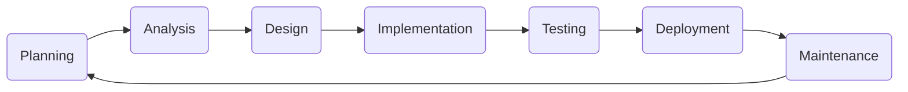
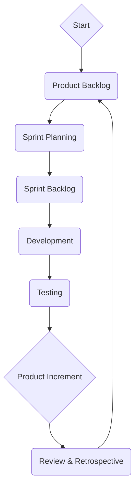

# Software Development Documentation

## Table of Contents
- [Software Development Documentation](#software-development-documentation)
  - [Table of Contents](#table-of-contents)
  - [Introduction ](#introduction-)
  - [Software Development Lifecycle (SDLC) ](#software-development-lifecycle-sdlc-)
  - [Software Development Principles ](#software-development-principles-)
  - [Software Development Methodologies ](#software-development-methodologies-)
  - [Software Development Tools ](#software-development-tools-)
  - [Mermaid Diagrams ](#mermaid-diagrams-)
    - [Software Development Life Cycle (SDLC)](#software-development-life-cycle-sdlc)
    - [Agile Process](#agile-process)

---

## Introduction 

Software development involves the process of conceiving, specifying, designing, programming, documenting, testing, and bug fixing involved in creating and maintaining applications, frameworks, or other software components.

---

## Software Development Lifecycle (SDLC) 

The Software Development Life Cycle (SDLC) is a process methodology for software development. Typically, the process goes as follows:

1. **Planning:** Identifying the need for a specific software to solve a particular business problem.
2. **Analysis:** Defining software requirements and specifications.
3. **Design:** Defining the software architecture.
4. **Implementation/Coding:** Writing the code for the software.
5. **Testing:** Verifying that the software meets the requirements and is bug-free.
6. **Deployment:** Implementing the software to production.
7. **Maintenance:** Ongoing support to fix issues and add new features.

---

## Software Development Principles 

1. **Keep it Simple, Stupid (KISS):** The KISS principle states that most systems work best if they are kept simple rather than made complicated.

2. **Don't Repeat Yourself (DRY):** Every piece of knowledge must have a single, unambiguous, authoritative representation within a system.

3. **You Aren't Gonna Need It (YAGNI):** Implement features when you actually need them, not when you foresee you need them.

4. **Single Responsibility Principle (SRP):** A class should have one, and only one, reason to change.

5. **Open-Closed Principle:** Software entities (classes, modules, functions, etc.) should be open for extension but closed for modification.

6. **Liskov Substitution Principle:** Subtypes must be substitutable for their base types.

7. **Interface Segregation Principle:** Clients should not be forced to depend on interfaces they do not use.

8. **Dependency Inversion Principle:** Depend on abstractions, not on concretions.

---

## Software Development Methodologies 

- **Waterfall:** Sequential design process, where progress is seen as flowing steadily downwards (like a waterfall) through different stages.
- **Agile:** A set of principles for software development under which requirements and solutions evolve through the collaborative effort of self-organizing cross-functional teams.
- **Scrum:** An agile framework for managing knowledge work, with an emphasis on software development.
- **Kanban:** A lean method to manage and improve work across human systems.
- **Extreme Programming (XP):** A software development methodology which is intended to improve software quality and responsiveness to changing customer requirements.

---

## Software Development Tools 

- **IDEs (Integrated Development Environments):** Visual Studio Code, IntelliJ, Eclipse, PyCharm, etc.
- **Version Control Systems:** Git, Mercurial, SVN, etc.
- **Build Tools:** Maven, Gradle, Make, etc.
- **CI/CD Tools:** Jenkins, Travis CI, CircleCI, etc.
- **Testing Frameworks:** JUnit, NUnit, pytest, etc.
- **Containerization Tools:** Docker, Kubernetes, etc.

---

## Mermaid Diagrams 

Here are some diagrams to help illustrate the principles and processes:

### Software Development Life Cycle (SDLC)

### Agile Process

These diagrams help visualize the process and principles involved in software development. Remember that the methodologies, principles, and tools used can vary greatly depending on the specific needs and context of the project.